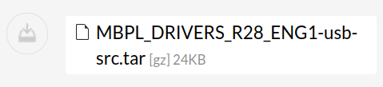
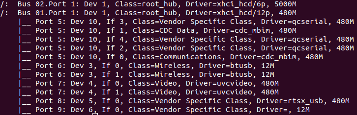
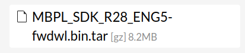
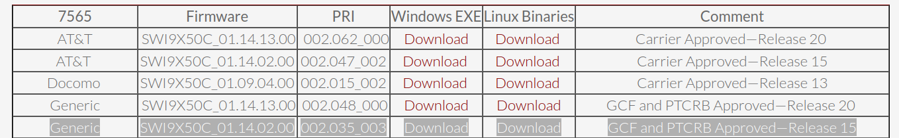
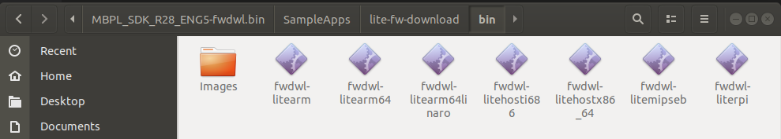
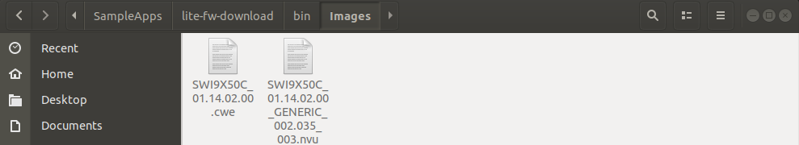

# Sierra Wireless EM7565
## Scope
This project aim to communicate with EM7565 (Module Sim 4G) through Serial using AT command.
- [EM7565](https://source.sierrawireless.com/devices/em-series/em7565/)
## Install driver
- __Step 1__: Download driver with this [Link](https://source.sierrawireless.com/resources/airprime/software/mbpl/mbpl-software-latest/#sthash.A75t1bEi.dpbs) \
 
- __Step 2__: Follow these step to build driver source
```
$ make
$ make install
```
- __Step 3__: Check driver. Connect EM7565 to your device
```
$ lsusb -t
```
See the result like the image below: _qcserial_, _cdc_mbim_

## Flash firmware to EM7565
- __Step 1__: Download SDK from [Link](https://source.sierrawireless.com/resources/airprime/software/mbpl/mbpl-software-latest/#sthash.3LcUbSys.dpbs) \

- __Step 2__: Download firmware from [Link](https://source.sierrawireless.com/resources/airprime/minicard/75xx/em_mc75xx-approved-fw-packages/#sthash.4YTPaFbK.dpbs). Select EM7565 Firmware, Generic, Linux Binaries. \

- __Step 3__: Create new folder in folder _bin_ and name _Images_. Copy 2 images firmware and paste to _Images_


- __Step 4__: Check Linux kernel
```
$ uname -a
Linux vinhtran 5.4.0-125-generic #141~18.04.1-Ubuntu SMP Thu Aug 11 20:15:56 UTC 2022 x86_64 x86_64 x86_64 GNU/Linux
```
- __Step 5__: Open terminal in _bin_ and flash firmware
```
$ sudo ./fwdwl-litehostx86_64 -f Images
Application version: 1.0.2204.2
INFO: QDL Port  :  
INFO: Device Path: /dev/cdc-wdm1
INFO: FW  Path  :  Images
Target image Info:
Carrier    :GENERIC
FW Version :01.14.02.00
Model ID   :SWI9X50C
Package ID :003
PRI Version:002.035
SKU        :9999999
Switching device into download mode ...
Modem Needs PRI
Waiting for modem to disconnect from the host ...
Modem disconnected from host.
Waiting for modem to come up in BOOT and HOLD mode ...
QDL port found: /dev/ttyUSB0
BOOT and HOLD Mode. Downloading firmware ...
Downloading: Images/SWI9X50C_01.14.02.00_GENERIC_002.035_003.nvu
FW download succeeded.
Waiting for modem to come up in ONLINE mode ...
Modem is now in ONLINE mode ... 
FW update status: Successful
FW info from modem:
Model ID            : EM7565
FW Version          : SWI9X50C_01.14.02.00
Carrier Name        : GENERIC
Carrier PRI Revision: 002.035_003
Firmware Download Process completed
Exiting Application!!!

```
## Build
_Build project with Makefile_
```
$ make
```
## Run
```
$ ./build/uart_test
```
Press AT command \
Example:
| AT Command      | Respond |
| -----------     | ----------- |
| at              | OK       |
    

